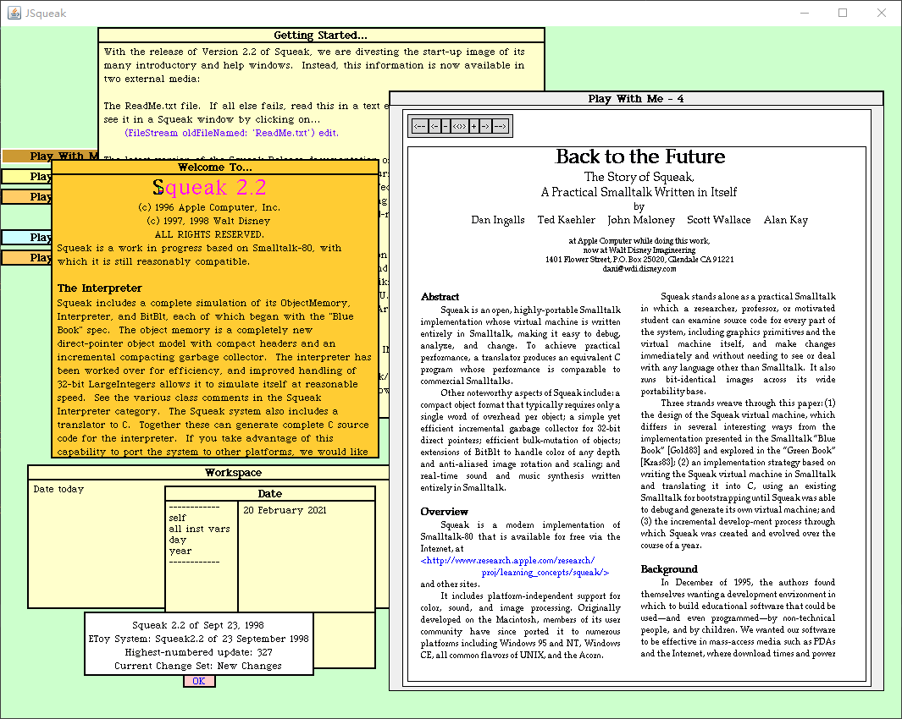

# JSqueak -- Java implementation of the Squeak Smalltalk Virtual Machine

This is a fork of **JSqueak**.

JSqueak is a Java implementation of the Squeak Smalltalk virtual machine, originally 
developed by Daniel H. H. Ingalls.

Since the official site of JSqueak: 
http://research.sun.com/projects/JSqueak 

seems to be deprecated, this repository is forked from repository of Victor Rodriguez: 
https://github.com/victorr/jsqueak

I have made some changes/improvements to the vm, now JSqueak can load and run a full version of Squeak 2.2 image, but it crashes easily.

## Goals
Currentlly, this repo is for studying purposes.

I'm trying to add more primitive implementations to the vm to run a full version of Squeak 2.2

### Notable changes / improvements:
* Fix floating-point number issue. Now JSqueak can read floating-point numbers from image file correctly. 
  To verfiy this issue, try to move/resize the "Welcome to Mini Squeak 2.2" window (in mini.image).
* Reduce input lag by using a separate thread to notify input event.
* Beta support for Window resizing (Have to do "restore display" twice manually after resizing).
* Beta support for 8-bit color display (Also have to "restore display" manually).

### TODO
* Add support for 16/32-bit color display
* More primitive implementations
* Performance optimization
* **and more ...**

## Useful Materials & References
Here are some useful materials for studying Smalltalk

**Squeak Official WebSite** 
https://squeak.org/

**Pharo Official WebSite** 
https://pharo.org/

**All history version of Squeak to downlaod** 
http://files.squeak.org/

**For Squeak 2.2** and its VM implementation in C source code  
http://files.squeak.org/2.2/2.2.tar.gz

**Back to the Future The Story of Squeak, A Practical Smalltalk Written in Itself** 
The original paper of Squeak Smalltalk. 
http://files.squeak.org/docs/OOPSLA.Squeak.html

**Smalltalk-80: The Language and its Implementation** (aka The BlueBook) 
http://stephane.ducasse.free.fr/FreeBooks/BlueBook/Bluebook.pdf

**codefrau/SqueakJS** 
An HTML5 runtime engine for Squeak Smalltalk written in pure JavaScript by Vanessa Freudenberg. 
https://github.com/codefrau/SqueakJS

**Potato VM** 
I found another fork/derivative of JSqueak named **Potato**, developed by HPI (Hasso-Plattner-Institut) 
It is also mentioned in the Document of another fork repo: [daitangio/jsqueak](https://github.com/daitangio/jsqueak)  
Potato's project announcement: https://news.squeak.org/2008/07/07/potato-version-of-jsqueak-from-hpi/  
its document: http://potatovm.blogspot.com/  
and its source code at sourceforge: https://sourceforge.net/p/potatovm/code  

*Victor Rodriguez, the owner of which this repo is forked from, was also participated in Potato's development. See: [AUTHORS](https://sourceforge.net/p/potatovm/code/HEAD/tree/trunk/AUTHORS)*

**devhawala/ST80** 
A Smalltalk-80 virtual machine by Dr. Hans-Walter Latz. Based on the "Bluebook" specification, implemented in Java 8. 
https://github.com/devhawala/ST80

**dbanay/Smalltalk** 
A C++ implementation of the Smalltalk-80 system by Dan Banay 
https://github.com/dbanay/Smalltalk

## License
JSqueak was released under the MIT license (see https://news.squeak.org/2008/06/21/jsqueak-smalltalk-interpreter-written-in-java).

